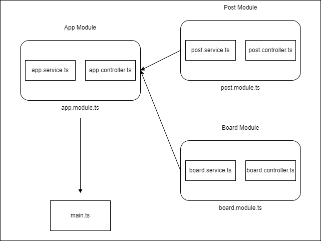

# 오픈소스SW입문 기말 프로젝트

## 주제 : Typescript 기반 서버 프레임워크인 Nestjs 소개

### 목차
 - [주제를 선정한 이유](#주제를 선정한 이유)
 - [선행 지식](#선행 지식)
   - [OOP란?](#OOP란?)
   - [Typescript](#Typescript)
   - [Dependency Injection](#Dependency Injection)
   - [SOLID](#SOLID)
 - [NestJS 소개](#NestJS란)
   - [NestJS의 장점](#장점)
   - [NestJS의 구조](#구조)
   - [프로젝트 초기화](#Initialization)
   - [프로젝트 현황](#현황)
 - [프로젝트를 마무리하며](#마무리)

# 주제를 선정한 이유

> 주제를 선정하게 된 가장 큰 이유는 단순히 서버 프레임워크를 사용해서 기능을 구현하는 것이 아닌  
> 재사용성 높은 코드, 가독성이 좋은 코드, 유지보수가 용이한 코드를 작성하는 것이  
> 얼마나 중요한지 설명하고 싶어서 주제를 선정하게 되었다.

# 선행 지식

## OOP란?

> 실제 사물을 코드에서 객체 형태로 사용하는 프로그래밍 방식

### OOP의 장점

- 코드의 재사용성이 높음
- 절차지향보다 간편한 코딩 방식을 가짐
- 디버깅이 쉬움

### OOP의 단점

- 처리속도가 절차지향에 비해 느림
- 설계에 많은 시간요소가 들어감

### 제가 생각하는 OOP의 최고 장점

> 읽기 쉬운 코드! 코드가 전체적으로 간소화되어 읽기 쉬운 코드를 작성할 수 있다.  
> 단점을 커버할 수 있는 중요한 이유라고 생각한다.

## Typescript

### Typescript를 설명하기 전에, Javascript란?

> Javascript는 웹에서 사용하는 인터프리터 언어이다. 현재는 ECMA 재단에서 코드 업데이트를 진행하고 있다.

### Typescript란?

> Microsoft에서 제공하는 Javascript에 Type을 부여한 형태의 Superset 언어이다.

Javascript는 변수에 대한 Type 선언이 존재하지 않기 때문에 아래와 같이 의도하지 않은 동작이 발생할 수 있다.  
```javascript
function sum(a, b) {
  return a + b;
}

// 의도한 동작
sum(10, 20); // 30

// 의도하지 않은 동작
sum('10', '20'); // '1020'
```

반면, Typescript는 Type 선언을 통해 의도하지 않은 동작을 차단할 수 있다.
```typescript
function sum(a: number, b: number): number {
	return a + b;
}

// 의도한 동작
sum(10, 20); // 30

// 의도하지 않은 동작
sum('10', '20'); // error TS2345: Argument of type '"10"' is not assignable to parameter of type 'number'.
```

## Dependency Injection

의존관계 주입(Dependency Injection, 이하 DI)을 설명하기 전에 의존관계란, "A가 B를 의존한다." 라는 의미에서 출발한다.  

"A가 B를 의존한다." 라는 말은 B가 변했을 경우, A에 영향을 미친다는 의미이기도 하다.  

즉, A가 B를 의존하면 B가 변했을 경우 A에 영향을 미친다는 의미이다.

`전구는 전기에 의존한다.` 라는 말을 아래 코드와 같이 작성할 수 있다.
```typescript
class Bulb {
	private electricity: NormalElectricity;
	
	constructor() {
		this.electricity = new NormalElectricity();
    }
}
```

만약 단순한 전기가 아닌 태양에너지를 활용하도록 변경하고자 한다면, 인터페이스와 추상화를 통해 변경할 수 있다.

```typescript
class Bulb {
   private electricity: Electricity;

   constructor() {
	   this.electricity = new SolarElectricity();
	   // this.electricity = new NormalElectricity();
   }
}

interface Electricity {
	newRecipe();
}

class NormalElectricity implements Electricity {
	newRecipe() {
		return new NormalElectricity();
    }
}

class SolarElectricity implements Electricity {
	newRecipe() {
		return new SolarElectricity();
    }
}

```

위의 예시는 의존관계를 Bulb 안에서 결정하고 있다. 이것을 DI를 통해 변경한다.  
Bulb 외부(진짜 `우리`들) 에서 어떤 에너지를 사용할지 결정하도록 변경할 수 있다.

```typescript
class Bulb {
	private electricity: Electricity;

	constructor(electricity: Electricity) {
		this.electricity = electricity;
		return this;
	}
}

interface Electricity {
	newRecipe();
}

class NormalElectricity implements Electricity {
	newRecipe() {
		return new NormalElectricity();
	}
}

class SolarElectricity implements Electricity {
	newRecipe() {
		return new SolarElectricity();
	}
}

class Human {
	private normalBulb = new Bulb(new NormalElectricity());
	
	private solarBulb = new Bulb(new SolarElectricity());
}

```

위 모습처럼, Bulb에 어떤 값을 넣을 지 외부에서 결정하는 과정을 의존관계 주입이라고 칭한다.

## SOLID

SOLID 원칙은 2000년대 초반, 로버트 마틴이 명명한 OOP 개발 및 설계의 다섯 가지 기본 원칙이다. 이는 아래와 같다.

    - Single Responsibility Principle(SRP) : 작성된 클래스는 하나의 기능만 가지며 그 하나의 책임만을 수행하는데 집중되어 있어야 한다는 원칙이다.
    - Open/Closed Principle(OCP) : 클래스는 확장에는 열려있고, 변경에는 닫혀있어야 한다는 원칙이다.
    - Liskov Substitution Principle(LSP) : 자식 클래스는 부모 클래스에서 가능한 행위를 모두 수행할 수 있어야 한다는 원칙이다.
    - Interface Segregation Principle(ISP) : 한 클래스는 자신이 사용하지 않는 인터페이스는 구현하지 않아야 한다는 원칙이다.
    - Dependency Inversion Principle(DIP) : 의존 관계를 맺을 때, 변화하기 쉬운 것 보단 변화하기 어려운 것에 의존해야 한다는 원칙이다.

프로그램을 설계할 때 위의 원칙을 적절히 지킬 경우, 코드의 재사용성 및 가독성 등 코드 자체의 질을 높일 수 있다.

# NestJS란

> NestJS는 Express.js와 같은 Node.js 기반 서버 프레임워크이다. Nest.js는 Spring-like Framework를 지향한다.

## 장점

    1. Node.js 기반 서버 프레임워크로 자주 사용되는 Express.js, Koa 등은 프로그램 디자인 측면에서 지원하는 것이 거의 전무함
    2. NestJS는 Spring과 유사한 형태를 가지고 있고, 여러가지 디자인을 적용하여 코드의 재사용성, 가독성을 높일 수 있음
    3. 다른 서드파티 라이브러리에 대한 지원이 존재하여, 쉽게 원하는 기능을 작성할 수 있음

## 구조

NestJS는 기본적으로 아래와 같은 모듈(Module) 구조가 적용되어 있다. 각 Module은 Controller, Service를 가지고 있다.  
NestJS는 Singleton 패턴을 사용하고 있기 때문에 인스턴스를 직접 생성하는 것이 아닌 모듈을 통해 Injection이 진행된다.



### Controller

요청이 들어오는 입구의 역할을 하며, 웹 백엔드를 공부할 때 나오는 Controller의 개념과 같은 역할을 한다.  
NestJS는 비즈니스 로직을 분리하는 것을 기본으로 삼고 있기 때문에, Controller로서 요청 지점을 분리했다.

### Service(Provider)

Service는 NestJS의 여러 데이터 처리 및 비즈니스 로직을 담당하며, 아래 표와 같이 세부적으로 구성된다.

| 이름              | 역할                  |
|-----------------|---------------------|
| Guard           | 사용자 인증              |
| Pipes           | 클라이언트가 전송하는 데이터 필터링 |
| Service         | 비즈니스 로직             |
| ExceptionFilter | 예외 처리               |
| Interceptor     | 위에 해당하지 않는 로직 수행    |
| Middleware      | 요청 중간에 수행되는 로직      |

## Initialization

NestJS를 사용하기 위해 두 가지 방법을 이용할 수 있다.

1. `npm`을 이용한 NestJS CLI 설치 및 사용
2. `npm init` 후 프로젝트 폴더에 NestJS 관련 모듈 `add`

이번 소개에서는 CLI를 활용한 프로젝트 초기화를 진행한다.

1. NestJS CLI 설치
   1. OS별 터미널에서 `npm install -g @nestjs/cli` 실행
   2. `nest new app` 커맨드 실행

위의 과정을 진행하게 되면 [sample](/sample) 디렉토리와 같이 NestJS 프로젝트가 초기화된 것을 볼 수 있다.

## 현황

- 본 기말프로젝트에서는 NestJS의 구조를 간단히 보여주기 위해 간단한 게시판 및 게시글 작성을 공유한다.  
- 위에서 설명한 모듈 구조의 예시와 같이, Post 모듈과 Board 모듈로 종류 별 게시판과 각 게시판에 쓰이는 게시글을 구성했다.  
- 단순 예시로 설명하기 위해 Database 구축은 진행하지 않았고, 실행시 초기화되는 객체를 활용한다.  

프로젝트는 아래의 구조로 이루어져 있다.

```typescript
src
|-- board // board 관련 모듈
    |-- BoardModule.ts
    |-- BoardService.ts
    |-- BoardController.ts
|-- post // post 관련 모듈
    |-- PostModule.ts
    |-- PostService.ts
    |-- PostController.ts
|-- lib // 기타 유틸리티 코드
    |-- example.ts
|-- AppModule.ts // 메인 모듈
|-- AppController.ts
|-- main.ts // 서버 구성 및 실행 파일
```

프로젝트는 다음의 기능을 수행할 수 있다.

- 게시글 생성
- 게시글 조회
- 게시글 분류 조회
- 게시글 분류 추가 (관리자 기능)

# 마무리

프로젝트를 마무리하며, 많은 사람들이 이 글을 통해 NestJS에 조금이라도 관심을 가져보면 좋을 것 같다.  
Express, Koa 등을 사용하면서는 느낄 수 없는 기초적인 패턴들이 탑재되어 있고, 실제 프로젝트 개발 시 여러 패턴을 쉽게 활용할 수 있는  
구조인 NestJS를 사용하면 재사용성, 가독성이 높은 코드를 작성하는 것이 가능하다.